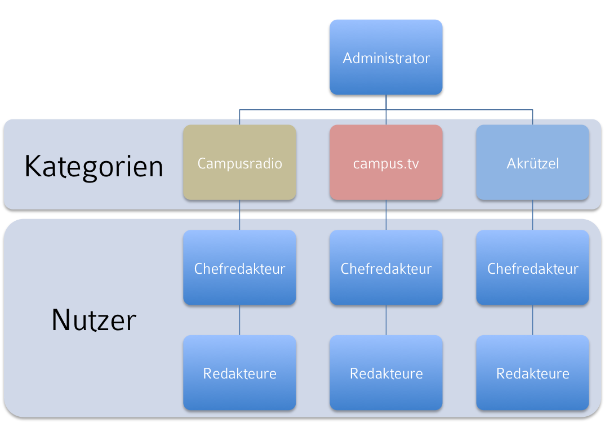

# Campusmedien Jena Webseite - Konzept #

## Allgemein ##

Campusmedien Jena bündelt die drei eigenständigen Rekationen Campusradio, campus.tv und Akrützel.

- Blogtitel: Campusmedien Jena
- Untertitel: ?? 
- URL: http://www.campusmedien-jena.de
- Email Adresse: ??

## Zielgruppe ##

Die Plattform richtet sich an Studenten, Universitätspersonal aus Jena und interessierte Menschen allgemein. 

## Technisches Konzept ##

Verwendet wird Wordpress Content Management System auf einer MySQL Datenbank. 
Der Webseite wird auf den Servern des STURA Jena gehostet, wobei folgende serverseitige Vorraussetzungen bestehen:

- Apache Webserver
- PHP 5
- MySQL
- FTP Zugang für Administration

## Struktur ##

## Frontend ##

- Nutzer können Beiträge der drei Intitutionen anschauen und kommentieren. 
- Für das Campusradio wird ein Livestream bereitstehen
- Nutzer können den Blog per RSS abonnieren und Beiträge auf sozialen Netzwerken teilen.
- Eine Anmeldung ist nicht erforderlich

## Backend ##

### Administrator ###

Dem Blog steht ein ``Administrator`` vor. Er hat vollen Zugriff auf Inhalte und Wordpress Dateien (Theme, Plugins, Widgets, ...).

### Chefredakteure ###

Dem Administrator sind 3 (oder mehr) ``Chefredakteure`` unterstellt, die jeweils einem Medium eindeutig zugeordnet sind. Sie können

- Beiträge verfassen
- Beiträge editieren
- Beiträge veröffentlichen (freigeben)
- Beiträge löschen
- Gastautoren-Accounts erstellen
- Accounts verwalten

### Redakteure ###

Den jeweiligen Chefredakteuren sind ``Redakteure`` (Autoren) und ihrem Medium unterstellt. Sie dürfen

- Beiträge verfassen
- Eigene Beiträge editieren

### Gastautoren ###

``Gastautoren`` sind einem Medium zugeordnet und haben dieselben Rechte wie dessen Autoren.

